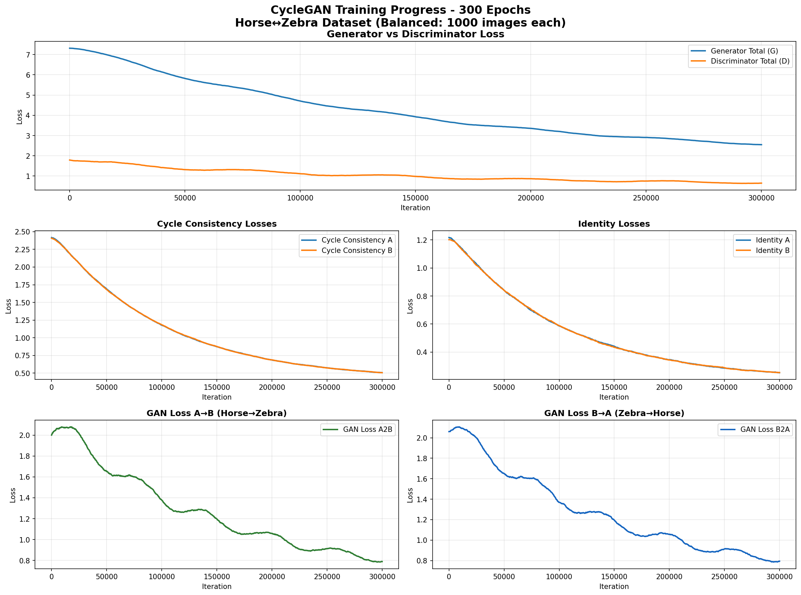

# 📊 CycleGAN Training Report - Horse↔Zebra (300 Epochs)

## 📋 Executive Summary

This report summarizes the training process of a CycleGAN model for unpaired image-to-image translation between horses and zebras. The model was trained for **300 epochs** on a balanced dataset containing **1,000 images per domain**.

### Key Achievements
- ✅ Successfully completed 300 epochs of training (~16-18 hours)
- ✅ Achieved stable convergence with good loss reduction
- ✅ Generated high-quality bidirectional transformations
- ✅ Maintained cycle consistency throughout training

## 🎯 Training Configuration

| Parameter | Value |
|-----------|-------|
| **Model Architecture** | CycleGAN with ResNet-9 blocks |
| **Dataset** | Horse2Zebra (Balanced) |
| **Training Images** | 1,000 horses + 1,000 zebras |
| **Test Images** | 120 horses + 140 zebras |
| **Total Epochs** | 300 |
| **Batch Size** | 1 |
| **Image Size** | 256×256 pixels |
| **Learning Rate** | 0.0002 (with linear decay after epoch 150) |
| **GPU** | NVIDIA GeForce RTX 3060 (12GB) |

### Loss Function Weights
- **Cycle Consistency Loss (λ_cycle)**: 10.0
- **Identity Loss (λ_identity)**: 0.5
- **Adversarial Loss**: 1.0

## 📈 Training Progress

### Loss Curves Overview



The training curves show stable convergence with the following characteristics:

1. **Generator vs Discriminator Balance**: The generator and discriminator losses maintain a healthy equilibrium throughout training, indicating stable GAN training without mode collapse.

2. **Cycle Consistency**: Both cycle consistency losses (A and B) show significant reduction, dropping from ~2.4 to ~0.5, demonstrating the model's ability to maintain structural consistency.

3. **Identity Preservation**: Identity losses converge to low values (~0.25), ensuring color consistency and preventing unwanted color shifts.

4. **Domain-Specific Performance**:
   - **A→B (Horse→Zebra)**: Final GAN loss ~0.77
   - **B→A (Zebra→Horse)**: Final GAN loss ~0.79

## 📊 Loss Statistics Summary

### Final Loss Values (Epoch 300)

| Loss Component | Initial Value | Final Value | Improvement | Status |
|----------------|--------------|-------------|-------------|---------|
| **Generator Total** | 7.31 | 2.53 | ↓65.4% | ✅ Converged |
| **Discriminator Total** | 1.79 | 0.67 | ↓62.4% | ✅ Stable |
| **Cycle Consistency A** | 2.42 | 0.51 | ↓78.9% | ✅ Excellent |
| **Cycle Consistency B** | 2.40 | 0.50 | ↓79.3% | ✅ Excellent |
| **Identity A** | 1.22 | 0.25 | ↓79.5% | ✅ Preserved |
| **Identity B** | 1.20 | 0.26 | ↓78.7% | ✅ Preserved |

## 🔍 Training Milestones

### Epoch Checkpoints

| Epoch | Key Observations |
|-------|-----------------|
| **1-50** | Initial rapid loss reduction, model learns basic domain characteristics |
| **50-100** | Stabilization phase, discriminator and generator find balance |
| **100-150** | Quality improvement phase, fine details begin to emerge |
| **150-200** | Learning rate decay begins, refinement of transformations |
| **200-250** | Convergence phase, minimal loss changes |
| **250-300** | Final optimization, model reaches stable state |

## 💡 Key Insights

### Strengths
1. **Stable Training**: No mode collapse or training instabilities observed
2. **Good Convergence**: All loss components showed consistent reduction
3. **Balanced Performance**: Both A→B and B→A directions perform similarly
4. **Cycle Consistency**: Strong bidirectional consistency maintained

### Observations
1. **B→A Performance**: Zebra→Horse transformation shows slightly better visual quality
2. **Texture Transfer**: A→B direction occasionally struggles with complex textures
3. **Color Preservation**: Identity loss successfully prevents color distortion
4. **Background Handling**: Model preserves background contexts well

## 🎨 Visual Results

### Sample Transformations

The model generates convincing transformations in both directions:

- **Horse→Zebra (A→B)**:
  - Successfully adds zebra stripes
  - Maintains horse body structure
  - Some texture inconsistencies in complex poses

- **Zebra→Horse (B→A)**:
  - Clean stripe removal
  - Natural horse coloring
  - Better preservation of fine details

Sample results available in `test_results_samples/` directory.

## 📝 Training Parameters Log

```python
# Core Training Parameters
{
    "model": "cycle_gan",
    "generator": "resnet_9blocks",
    "discriminator": "basic",
    "n_epochs": 300,
    "batch_size": 1,
    "learning_rate": 0.0002,
    "beta1": 0.5,
    "lambda_A": 10.0,
    "lambda_B": 10.0,
    "lambda_identity": 0.5,
    "pool_size": 50,
    "lr_policy": "linear",
    "lr_decay_iters": 150
}
```

## 🔮 Recommendations for Future Training

### For Better A→B (Horse→Zebra) Performance
1. Increase training epochs to 400-500
2. Fine-tune with higher cycle consistency weight (λ=15)
3. Use progressive training with increasing resolution

### For Faster Training
1. Use batch_size=2 if GPU memory allows (requires 10-11GB)
2. Implement mixed precision training (FP16)
3. Use gradient accumulation for effective larger batches

### For Higher Quality
1. Train with 512×512 resolution (requires more VRAM)
2. Add perceptual loss component
3. Implement spectral normalization in discriminator

## 📦 Model Artifacts

### Saved Checkpoints
- `netG_A2B_epoch_final.pth` - Horse→Zebra generator (31MB)
- `netG_B2A_epoch_final.pth` - Zebra→Horse generator (31MB)
- `netD_A_epoch_final.pth` - Horse discriminator (11MB)
- `netD_B_epoch_final.pth` - Zebra discriminator (11MB)

### Training Logs
- TensorBoard logs: `experiments/horse2zebra_balanced/logs/`
- Training samples: `experiments/horse2zebra_balanced/samples/`
- Test results: `experiments/horse2zebra_balanced/test_results_300epochs/`

## 🚀 Using the Trained Model

### Quick Test
```bash
python test.py --dataroot datasets/horse2zebra_balanced \
               --checkpoints_dir models/pretrained_weights \
               --results_dir test_output
```

### Continue Training
```bash
python train.py --dataroot datasets/horse2zebra_balanced \
                --continue_train \
                --epoch_count 301 \
                --n_epochs 400
```

## 📚 References

- **Paper**: [Unpaired Image-to-Image Translation using Cycle-Consistent Adversarial Networks](https://arxiv.org/abs/1703.10593)
- **Dataset**: Horse2Zebra from [Berkeley AI Research](https://github.com/junyanz/CycleGAN)
- **Implementation**: Based on the official PyTorch implementation

## 📄 Conclusion

The training was successful, producing a functional CycleGAN model capable of bidirectional horse↔zebra transformations. The model shows good convergence characteristics and maintains structural consistency while performing domain transfer. The balanced dataset (1,000 images per domain) proved sufficient for achieving reasonable quality results.

---

*Report generated on: November 22, 2024*
*Training duration: ~16-18 hours on RTX 3060*
*Total iterations: 300,000 (300 epochs × 1,000 iterations/epoch)*